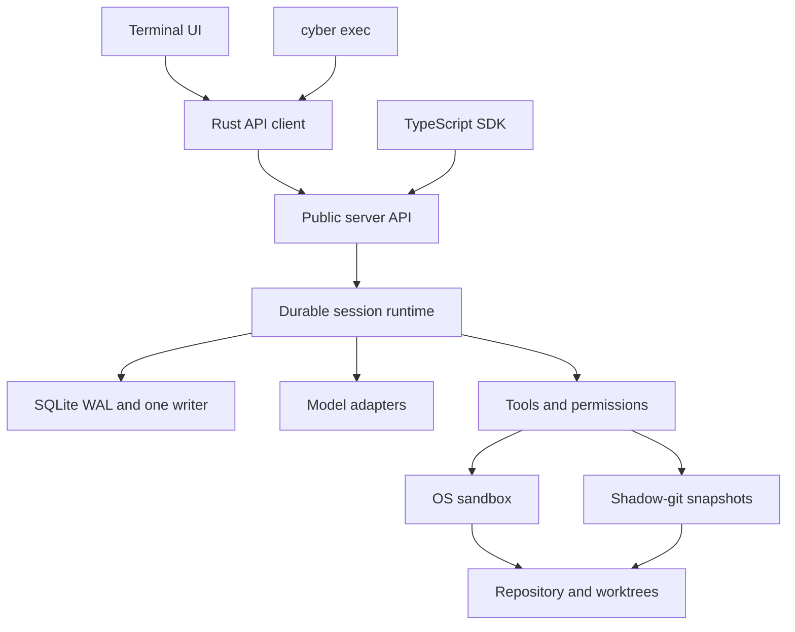
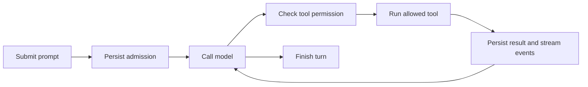

# Cyber Code (`cyber`)

A model-independent coding agent with durable local sessions, repository tools and a terminal UI.

Inspect code, edit files, run tests and resume interrupted work. Sessions stay on your machine in SQLite. Use OpenAI, Anthropic or an OpenAI-compatible endpoint, including a local model server. No Cyber account is required; hosted models require provider credentials.


Actual TUI capture, with no model inference. [Screenshots and reproduction](docs/screenshots/README.md).

<details>
<summary>See the CLI command reference</summary>


</details>

## Start here

Requires **Rust 1.89+**. SQLite is bundled. On Linux, install **bubblewrap** for sandboxed commands (`apt install bubblewrap`).

```bash
cargo build --locked -p cyber-cli
export OPENAI_API_KEY="your-key"

./target/debug/cyber                            # terminal UI
./target/debug/cyber exec "fix the failing test" # one task
./target/debug/cyber --continue                 # resume the latest session
./target/debug/cyber doctor                     # check your setup
```

Use `--model provider/model` to select a model. See the [local core guide](docs/local-core-guide.md) for configuration and [evaluation guide](eval/README.md) for local-model setup.

## What it does

| Area | Current behavior |
|---|---|
| Coding | Read/search repositories, edit files and notebook cells, run commands and use web tools |
| Sessions | Durable prompt admission, streaming, interrupt/resume, crash recovery and compaction |
| Safety | Checkout trust, tool permissions, protected paths, credential masking and macOS/Linux sandboxing |
| Recovery | Shadow-git snapshots, restore preserving user edits, database-plus-artifact backup and retention |
| Skills | Bundled `/review`, `/batch`, `/simplify`, `/security-review` and `/customize-cyber`; replaceable templates and forked reviewer tasks |
| Clients | TUI, `exec`, background service, public API and generated TypeScript SDK |
| Partial P1 | Subagents/worktrees, cancellation controls, usage/budgets, hooks/local MCP, memory, LSP navigation and edit feedback, automatic formatting, migration detection and read-only previews |

**P0 is implemented, with release gates still open:** the full local-model baseline, including the long coding task, remains incomplete. **P1 is in progress; no P1 milestone is fully accepted.** Windows confinement, remote MCP/OAuth, plugins, complete client controls, browser verification and migration/editor integration still need work or acceptance. Later phases cover workflows, goals, remote control and cloud runners.

See the [complete feature reference](docs/features.md), [P0 evidence](docs/measurements/p0-exit-evidence.md), [P1 status](docs/implementation/p1-status.md) and [roadmap](ROADMAP.md).

## Architecture



The server owns execution, compaction and recovery. Clients use HTTP, SSE, WebSocket or stdio JSON-RPC. SQLite stores execution state; snapshots store file recovery data. Built with Rust, tokio, axum, rusqlite and ratatui. [Architecture details](docs/local-core-guide.md#architecture).



## How it compares

Scope: **Cyber Code, Claude Code, Codex and OpenCode coding tools**, checked **2026-10-10**. This compares documented capabilities, not coding quality or speed. Partial means our implementation has working pieces and remaining contracts or acceptance gates.

| Feature | Cyber Code | Claude Code | Codex | OpenCode |
|---|---|---|---|---|
| Edit files and run commands | Yes | Yes [docs][C1] | Yes [docs][X1] | Yes [docs][O1] |
| Model providers | OpenAI, Anthropic, compatible endpoints | Claude through supported providers [docs][C1] | OpenAI and custom providers [docs][X2] | Multiple providers [docs][O2] |
| Local models | Compatible adapter; full baseline pending | Not established by cited docs | Ollama / LM Studio [docs][X2] | Ollama / LM Studio [docs][O2] |
| Terminal and automation | TUI and `exec` | CLI and SDK [docs][C1] | CLI and `exec` [docs][X1] | TUI and CLI [docs][O1] |
| Editor / desktop / web clients | Full clients planned | Available [docs][C1] | IDE and cloud surfaces [docs][X1] | Desktop and IDE [docs][O1] |
| Tool permissions | Yes; full auto mode partial | Yes [docs][C2] | Yes [docs][X3] | Yes [docs][O3] |
| OS sandbox | macOS/Linux; Windows incomplete | macOS/Linux/WSL2; native Windows unsandboxed [docs][C2] | Documented sandbox controls [docs][X3] | Permission rules documented [docs][O3]; OS isolation not established here |
| Subagents | Partial P1 | Yes [docs][C3] | Yes [docs][X1] | Yes [docs][O4] |
| MCP integration | Local partial; remote/OAuth pending | Local and remote [docs][C4] | stdio and HTTP [docs][X2] | Local and remote [docs][O5] |
| File undo / recovery | Snapshots preserving user edits | Edit checkpoints and rewind [docs][C5] | Git checkpoints recommended [docs][X1] | Undo/redo [docs][O1] |
| Programmatic server | HTTP/events, stdio API, TS SDK | Agent SDK [docs][C1] | App Server [docs][X4] | HTTP/OpenAPI and SDK [docs][O6] |
| LSP integration | Navigation/feedback partial P1 | Language-server plugins [docs][C6] | Not established by cited docs | Built-in LSP support [docs][O7] |

“Not established” means the linked sources do not establish support; it does not mean the feature is absent. These products have different defaults, platform limits and release channels. Cyber's [feature reference](docs/features.md) records our implementation limits.

## Documentation and development

[Documentation index](docs/README.md) · [Commands and configuration](docs/local-core-guide.md) · [Roadmap](ROADMAP.md) · [SDK](sdk/typescript/README.md) · [OpenAPI](sdk/openapi.json) · [Evaluations](eval/README.md) · [OpenSpec contracts](openspec/specs)

Run `just` to list tasks, `just build` to build and `just ci` for local checks. Platform builds run in [CI](.github/workflows/ci.yml). See the [development guide](docs/local-core-guide.md#build-and-development) for raw commands and the pinned specification validator.

[C1]: https://code.claude.com/docs/en/overview
[C2]: https://code.claude.com/docs/en/sandboxing
[C3]: https://code.claude.com/docs/en/sub-agents
[C4]: https://code.claude.com/docs/en/mcp
[C5]: https://code.claude.com/docs/en/checkpointing
[C6]: https://code.claude.com/docs/en/discover-plugins
[X1]: https://learn.chatgpt.com/docs/codex/cli
[X2]: https://learn.chatgpt.com/docs/config-file/config-reference
[X3]: https://learn.chatgpt.com/docs/security
[X4]: https://learn.chatgpt.com/docs/app-server
[O1]: https://opencode.ai/docs/
[O2]: https://opencode.ai/docs/providers/
[O3]: https://opencode.ai/docs/permissions/
[O4]: https://opencode.ai/docs/agents/
[O5]: https://opencode.ai/docs/mcp-servers/
[O6]: https://opencode.ai/docs/server/
[O7]: https://opencode.ai/docs/lsp/
