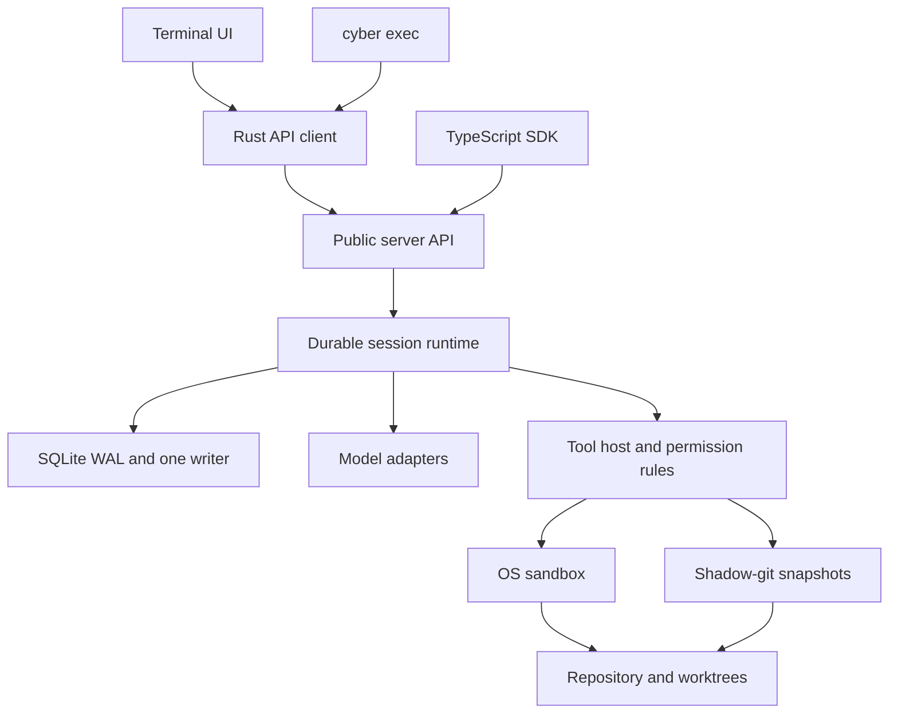

# Cyber Code (`cyber`)

A model-independent coding agent with durable local sessions, repository tools, a terminal UI and a public server API.

Inspect and edit a repository, run verification, preserve user changes and resume after interruption. The local core uses SQLite and runs without a Cyber account; hosted model calls need provider credentials and connectivity.

## Status

**P0 implementation is built; its release gates are not closed.** A complete local-model coding baseline, including the long task, remains open. An Ollama/Qwen3.5 9B pilot passed one small task. Recovery/trust tests, per-tool goldens, storage measurements and all six macOS/Linux build targets have passing evidence. Recorded default-service startup meets the 150 ms first-frame target on the named M2 Max machine; embedded mode retains an outlier. See [P0 evidence](docs/measurements/p0-exit-evidence.md) and [evaluation setup/results](eval/README.md).

**P1 implementation is active in M1.1–M1.4; no P1 milestone is fully accepted.** Native Windows long-root inspection and isolated-child execution have passing CI evidence, while complete Windows confinement remains open. Subagents, worktrees and cancellation have substantial partial implementations. Hook configuration, individual trust review and Unix command hooks around built-in tools are implemented locally; complete hook delivery remains open. M1.4 has local Unix memory storage, a model tool, CLI management, reviewed local recovery and paired reconciliation through a running server, plus HTTP/SDK CRUD and pinned-journal recovery with session updates and durable change events. Memory now has reviewed TUI editing with private draft/request checkpoints and fresh review after restart. Windows private memory reads and native client checkpoint storage are implemented; Windows public checkpoint and TUI persistence tests pass; Windows core note mutation, paired SQLite reconciliation and owner-death recovery have native evidence. Windows application mutation tests pass natively; model-tool and context tests also pass natively. CLI admission and complete outcome/recovery controls remain open. The [P1 status](docs/implementation/p1-status.md) and [roadmap](ROADMAP.md) track remaining contracts and acceptance gates.

## Quick start

Requires Rust 1.89 or newer; SQLite is bundled. Linux sandboxed commands also require bubblewrap (`apt install bubblewrap`).

```bash
cargo build --locked -p cyber-cli
export OPENAI_API_KEY="your-key"

# Open the TUI in the current repository.
./target/debug/cyber

# Run a task without the TUI.
./target/debug/cyber exec "fix the failing test"

# Inspect configuration, providers, storage and sandbox support.
./target/debug/cyber doctor
```

OpenAI Responses, Anthropic Messages and OpenAI-compatible Chat endpoints are supported, including local servers. See the [local core guide](docs/local-core-guide.md) for commands and [evaluation guide](eval/README.md) for local-model setup.

## Features

“Available” describes implemented local-core behavior. “Partial P1” means working pieces exist and the full contract still needs implementation or acceptance.

| Area | What you can use today | Status |
|---|---|---|
| Models | Provider adapters, model catalog, credentials and usage pricing | Available; broader catalog work remains |
| Sessions | Durable inbox, streaming tool loops, interrupt/resume, crash recovery and compaction | Available |
| Tools | Repository inspection/editing, command execution, web tools and instruction/skill loading | Available; broader skills/commands remain |
| Safety | Workspace trust, permission rules, protected paths, auto classification with confirmed `/approve`, macOS/Linux sandboxing and credential masking | Available; Windows enforcement, proxy coverage and full auto-mode controls remain partial P1 |
| File recovery | Shadow-git snapshots and conflict-aware restore preserving user edits | Available; broader rewind UI remains |
| Clients | TUI, noninteractive `exec`, background service, HTTP/SSE/WebSocket/stdio API and generated TypeScript SDK | Available; complete P1 client surfaces remain |
| Subagents | Foreground/background children, named resume, forked context, structured results, approvals and task controls | Partial P1 |
| Worktrees | Managed startup and isolated children, setup journals, file summaries, cleanup and reviewed setup retry | Partial P1; public lifecycle and unknown-effect recovery remain |
| Cancellation | Durable admission closure, exclusive child result ownership, bounded stop reports and matched reopening | Partial P1; unknown-effect recovery, cross-process actor cancellation and exec/TUI adoption remain |
| Spending | Durable own/descendant billing, atomic usage API, TUI `/cost` and soft Session budgets | Partial P1; reservations, daily caps and complete enforcement/displays remain |
| Hooks | CLI/TUI definition and receipt review, exact handler trust, Unix command, HTTP, prompt and local MCP-tool hooks, plus synthetic `cyber hooks test` | Partial P1; other handlers/events, complete scheduling, Windows confinement and plugins remain |
| MCP | Local approvals, shared tools/status, startup waiting, schema search and bounded reconnect | Partial P1; remote transports and resources/prompts remain |
| Memory | Durable project/global notes, built-in memory tool, session index updates, CLI management and local/server recovery, authenticated HTTP/SDK CRUD/recovery, TUI review/editing/deletion/recovery, private draft/request checkpoints, request outcome lookup/record controls and durable change events | Partial P1; legacy recovery, Windows CLI writes and broader native/client acceptance, broader client acceptance and multi-client retention remain |
| Operations | Database-plus-artifact backup, verify/restore, retention, logs and diagnostics | Available; broader observability remains |

Remaining P1 scope includes hooks/plugins/MCP (M1.3), memory/code intelligence/browser verification (M1.4), migration/editor integration (M1.5), the local web client and the other P1-tagged APIs. Workflows, goals, loops, remote control and cloud runners belong to later phases. The [capability map](docs/local-core-guide.md#specification-capability-map) covers the full planned product; [OpenSpec](openspec/specs) defines the contracts by phase.

## Architecture



The server owns prompt admission, Turn execution, compaction and recovery. Clients share its API over HTTP, SSE, WebSocket or stdio JSON-RPC. SQLite stores local execution state with FULL synchronization; snapshots preserve repository recovery data. Model adapters connect to OpenAI, Anthropic and compatible endpoints.

Built with Rust, tokio, axum, rusqlite and ratatui. See the [workspace crate map](docs/local-core-guide.md#workspace-and-specifications) and [storage architecture decision](docs/decisions/0001-storage-architecture.md). PostgreSQL is reserved for later hosted services.

## Documentation and development

- [Local core guide](docs/local-core-guide.md): commands, subagents, worktrees, budgets, recovery, configuration paths and terminology.
- [Roadmap](ROADMAP.md) and [P1 implementation status](docs/implementation/p1-status.md): delivery scope, evidence and remaining work.
- [TypeScript SDK](sdk/typescript/README.md) and [OpenAPI document](sdk/openapi.json): programmatic access.
- [Evaluation guide](eval/README.md): fixtures, provider baselines and local-model setup.
- [OpenSpec contracts](openspec/specs): implemented and planned behavior, tagged by phase.

Run `just` to list development tasks, `just build` to build and `just ci` for local lint, tests, specification and SDK checks. Platform builds run in [CI](.github/workflows/ci.yml). Raw commands and the pinned specification validator are in the [development guide](docs/local-core-guide.md#build-and-development).
