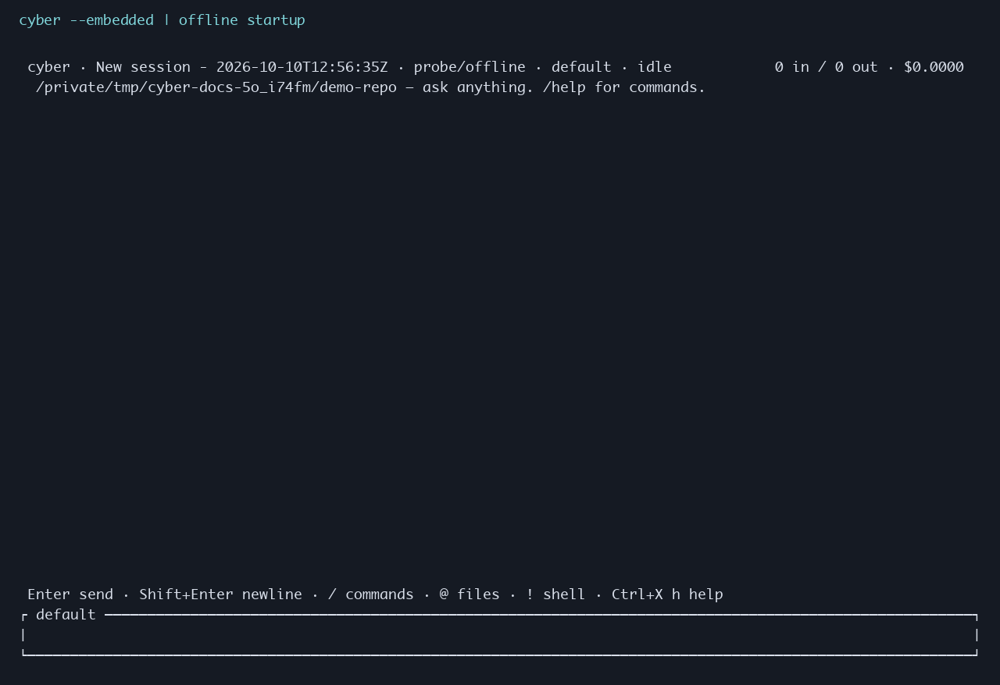
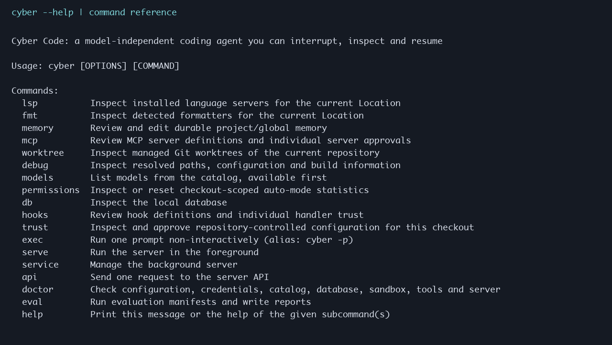

# Screenshots

Captured on **2026-10-10**, macOS arm64, using the local debug binary. The images render actual terminal output with Monaco; the TUI uses a real 112×30 PTY. They are not mockups or generated product screens.

## Terminal UI



An isolated demo repository, temporary application home and an embedded server, using the configured `probe/offline` model. No prompts are submitted and no inference is performed. This shows startup controls, not a completed coding session.

## Command reference



The commands section of `cyber --help`, without the longer options section. Run `cyber --help` or `cyber <command> --help` for the full reference.

## Refresh

From the repository root, after building the CLI:

```bash
python3 -m venv /tmp/cyber-docs-render-env
/tmp/cyber-docs-render-env/bin/pip install pillow pyte
/tmp/cyber-docs-render-env/bin/python scripts/capture_docs.py
```

The script creates and removes its own temporary home and demo repository. It runs a private embedded server, without connecting to the user's running service. On other systems, pass `--font /path/to/monospace.ttf`; use `--binary` to select another built CLI.
